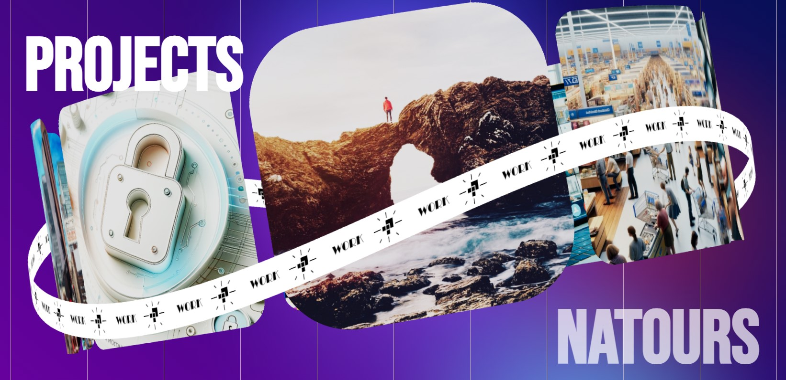

# Portfolio Website

Old portfolio website. In this readme you will find details about the libraries used in this project.

## Libraries Used

### `@pmndrs/assets` 
This library is a collection of pre-made assets, such as models and textures, optimized for use with the `react-three/fiber` ecosystem. It simplifies the process of adding complex 3D objects to your React application.
- [Documentation](https://github.com/pmndrs/assets)

### `@react-three/drei` 
`@react-three/drei` is a useful collection of helpers, abstractions, and components that work on top of `react-three/fiber`. It provides a wide range of ready-to-use components which can speed up your 3D application development.
- [Documentation](https://github.com/pmndrs/drei)

### `@react-three/fiber` 
This library is a React renderer for Three.js. It brings the power of React's component-based architecture to Three.js, enabling more organized and maintainable 3D scene construction.
- [Documentation](https://github.com/pmndrs/react-three-fiber)

### `@react-three/postprocessing` 
It provides a way to integrate post-processing effects in your `react-three/fiber` applications. This library is essential for adding advanced visual effects to your 3D scenes.
- [Documentation](https://github.com/pmndrs/react-postprocessing)

### `@types/three` 
This package contains TypeScript type definitions for Three.js. It's crucial for TypeScript users to ensure type safety and autocomplete features while working with Three.js in a TypeScript environment.
- [Documentation](https://www.npmjs.com/package/@types/three)

### `react` & `react-dom` 
React is a JavaScript library for building user interfaces. It allows you to create reusable UI components. `react-dom` provides DOM-specific methods that can be used at the top level of your app.
- [React Documentation](https://reactjs.org/docs/getting-started.html)
- [ReactDOM Documentation](https://reactjs.org/docs/react-dom.html)

### `react-scripts` 
This package includes scripts and configuration used by Create React App. It helps in setting up a development environment for React and handles build configurations for production.
- [Documentation](https://github.com/facebook/create-react-app/tree/main/packages/react-scripts)

### `three` 
Three.js is a cross-browser JavaScript library and API used to create and display animated 3D computer graphics in a web browser using WebGL.
- [Documentation](https://threejs.org/docs/index.html#manual/en/introduction/Creating-a-scene)

## Usage Notice

Please be aware that the code for this portfolio website is personal and proprietary. 

---

